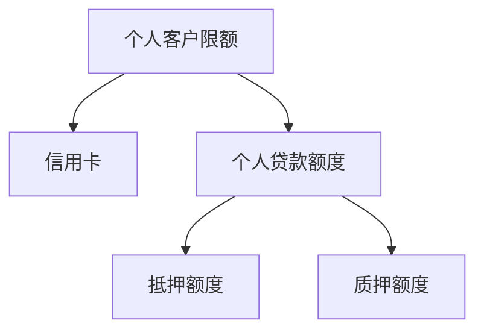

# 一、基本图示

数据处理流程
![[Pasted image 20231025090904.png |1000]]

额度树
![[Pasted image 20231025090423.png | 1000]]

抵押额度可以有多个，信用额度只有一个
# 二、相关问题

## 2.1 业务问题

### 2023-10-27
逻辑本质：客户真的能用多少钱

* 一颗额度树的计算是以==客户==为主，还是以==客户+事项==为主  ==客户+额度层一级分类类型==
* 一颗额度树的计算是以==客户+科目==细分为主么，那案例1的8和12是记到一个科目细分么 ==记账只记20==
* 案例1的信秒12记到哪个科目，平台8记到哪个科目 ==都记到52204-0201下==
* 会不会一颗额度树，既有抵押额度，又有信用额度
* 案例C怎么记账，每个实例怎么记账
* 是不是每个情况都应该有额度树，案例D、E没有风险权重排序？
* 案例F（150）、G一样？
* G、H的区别
* 额度编号和额度节点是什么关系 ==额度表 节点表 一对多==
* 这个贷款承诺的计算是不是用不到额度树，只用《转换系数表》

实际有三类
实额度：类似于信用卡
专项：已经签了买房车的消费场景找到银行，极大概率会用钱
没有额度，客户可能会用钱，买大件

专项不会有循环，按揭和车贷都没有可能，实额度没有非循环

知识点：
额度中心
可用额度=授信金额-已用额度-冻结金额
额度有币种概念
额度表技术分片键等同于用户编号
额度表 节点表 一对多
额度关系 额度 1对2
节点已用分组表：已用了多少钱
保证额度：授信金额-->已用额度-->冻结金额
额度中心只存用户号，个贷只存客户号，用户号，衔接点是用户号、额度编号
节点表里存有产品信息：节点名称nod_nam，带字母的就是产品编码（例：B+17为数字）

个贷中心
找个贷获取可用额度，没发生占用（在途）的时候，额度中心无法获取准确的可用的额度

### 2023-10-30

#### 待办

业务：张乃夫
根据个贷产品更新参数表
明确结果表所需相关字段

额度中心：接口人杨建春
与个贷同事明确数据关联关系
提供结果表中额度相关字段加工逻辑

个贷系统：接口人乔勇
从产品中心把产品表要下来
转换系数表维护细粒度到产品

大数据中心：
个贷数据入湖
个贷、额度生产提数
确定结果表结构、字段属性、加工逻辑
与核心确认入账方式

#### 知识点
1.会有多个超占，累加计算超占
2.信秒贷周期很短，车贷、房贷周期很长，车贷有类似贷款承诺函
3.车贷是可以超占的，这个超占是指实际贷出大于创建时候给的额度。
个贷在途的业务有两种：房抵、车
4.系数表需要细粒度到产品
额度协议号对应额度表里的额度编号

==车是预占，签约即占==
==额度中心额度状态：登记、修改、交易  ==

承诺的额度从额度中心获取，在途从个贷获取

机构、币种、科目、顺序号，

系数表里的是否循环不是额度中心的字段

==房抵产品有些归到房抵额度，有些直接归到房抵综合额度==

#### 问题点
- [x] 结果表里是计算发生额还是余额需要跟核心确定 ==计算余额==
- [x] E案例左边会不会挤到右边
- [x] 节点表叶子节点都是产品么 ==有些不是产品==
- [x] 额度协议表 和 额度协议与担保协议关系表是一一对应的么，测试环境这两个表里的数据量不一致，==可以没有担保协议==
- [x] 计算这个贷款承诺的时候是不是不需要关注这个树形结构，只要有转换系数表就够了 ==不够，信用额度下要细分到信用综合额度==

额度中心
- [x] 已用敞口金额和已用授信金额有什么区别 ==不需要关注敞口==
- [x] 额度中心的数据最细粒度的是节点表，节点表里包含了额度表里的所有额度编号，但是这部分节点表里有，额度表里没有的额度编号是什么情况？
==技术分片键 和用户编号一致==
- [x] 额度关系类型的码值==后续给==
- [x] 信用专项经营额度、信用专项场景额度怎么分类（==场景是经营的子类，额度中心重新整理一下额度树==）
- [x] 那些额度类型有产品编号，哪些额度类型没有产品编号  ==信用挂产品，（受托支付名单内，没有产品码）抵押、质押、保证没有产品==
- [x] 每棵树的可用额度 ==授信-已用-冻结，关注银行号、币种、生效/失效状态==

哪段时间可用，失效的要不要统计，生效状态

个贷
- [x] 个贷怎么确定在途的额度（额度授信协议表 有已经签了协议但是未放款），在途的数据为什么要卡未生效的
- [ ] 额度协议表里的入账机构不一定到支行
- [ ] 房抵额度从哪获取，抵押没有放款，计算状态如何判断：创建未生效，创建已生效，有在途，已放款
- [x] 房抵额度管理人填的可用金额从哪获取，好像在个贷 ==贷款协议文本表==

业务
- [x] 车贷放款之后还是否挤占信用综合额度

综合
- [x] 额度中心在途，个贷的在途是不是都要考虑
- [x] 额度中心数据的过滤规则，个贷数据的过滤规则  额度协议（未生效、生效、冻结）
可提款到期日内的
额度协议状态失效，额度中心可能是还是生效

个贷在途 车房
（已签约但是未放款成功的） 额度已创建-额度生效前
前提：有效、在途算贷款承诺
额度协议状态：0
关系表有值=根据授信协议编号能关联出数据，代表在额度中心已经创建额度
贷款文本表 根据授信协议编号中放款状态不为放款成功
额度协议表额度协议类型=1（虚额度）

房抵在途：（在额度中心算）实额度
跟已生效的一样，根据公式
额度中心有数，但是是未生效的状态
==（这个时候个贷记录的数据是什么样的）==

非在途
额度协议状态=1
额度协议类型=0
当前日期<=额度协议表【提款到期日】
可用额度=授信额度-冻结-已用
贷款承诺：乃夫老师公式
额度中心限制条件
==额度状态、节点状态为生效==
==产品节点提款有限期到期了之后没有必要算可用，失效的节点没有必要算可用==

个贷与额度中心数据关联
(简悦)
授信-冻结-已用

信用额度
优先找产品，受托支付名单内的产品码在额度中心没有记录，只是记了节点名称受托支付名单内。

质押和保证
节点表里和个贷里一对一

房抵额度

狭义在途（额度中心在途）
#### 功能设计
系数表匹配不到需要有机制通知到业务，系数表相同的取金额大的
信用整体公共按20，默认按最大的20

==以个贷（个贷协议表）为主表，匹配额度表，在途的数据从个贷获取==
机构号肯定不为空

==筛选要剔除村镇业务==

个贷提供的表是拉链表，额度中心的表是日分区表，全量表

抵押、抵押综合、质押、质押保障没有产品

### 2023-11-06

1、转换系数的排序处理，是否加上在途金额，==额度中心的额度会减到负值==
2、个贷的额度编号是从额度中心获的，理论上是额度中心先有额度数据，个贷后有贷款数据？==申请是从个贷系统申请的，车、房 ==
3、结果表里的可用额度怎么算？  各个额度协议编号的金额
4、减值准备这次不算？
5、循环标志和科目是一致的？
==52204-0201 非循环，52208-0101循环==
6、产品转换系数表的补齐：导表漏了
7、==在途只有车贷、房抵两种==
8、==车贷在途的额度取的个贷的贷款金额字段==
9、房抵的在途金额，在个贷，额度中心有数，但是是未生效的状态，这个时候个贷有记录么？
个贷在途 车
（已签约但是未放款成功的） 额度已创建-额度生效前
前提：有效、在途算贷款承诺
额度协议状态：0
关系表有值=根据授信协议编号能关联出数据，代表在额度中心已经创建额度
贷款文本表 根据授信协议编号中放款状态不为放款成功
额度协议表额度协议类型=1（虚额度）

车贷

房抵在途：（在额度中心算）实额度
跟已生效的一样，根据公式
额度中心有数，但是是未生效的状态
这个时候个贷记录的数据是什么样的？

在途：
额度中心额度值-冻结-已用-个贷40=可用抵押额度 70-40=30
可用房抵额度=60
min（可用抵押额度，可用房抵额度）=30

放款后：
直取额度中心数据
可用抵押额度=30
可用房抵额度=60
min（可用抵押额度，可用房抵额度）=30

10、个贷的输入表

![[Pasted image 20231107153919.png|1000]]

最终的结果是场景30，酒50，信秒、小微是0

1. 信秒、小微、场景  权重一样，按照可用额度大小排序=40、10、50
2. 因为次级节点（左树=30）
3. 所以用场景去 30-50=-20，
4. 30列入522科目（非超占的，只算正数部分）。

